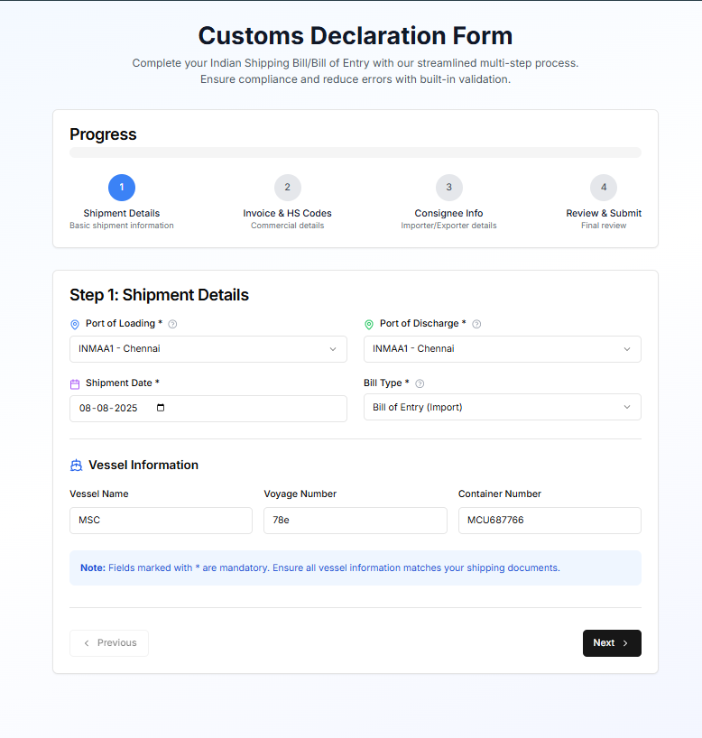
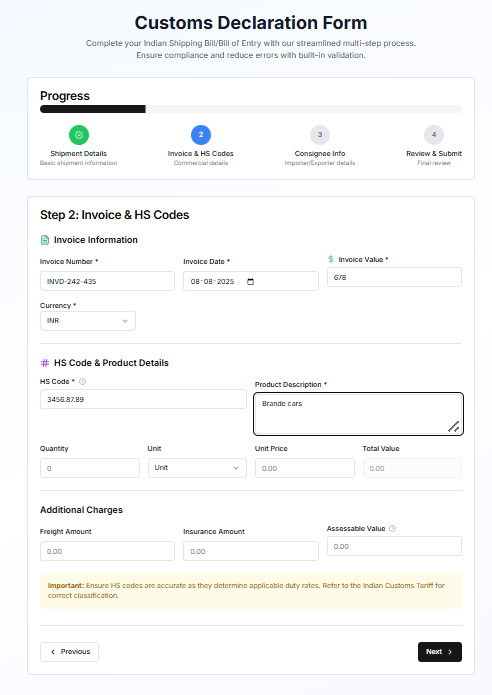
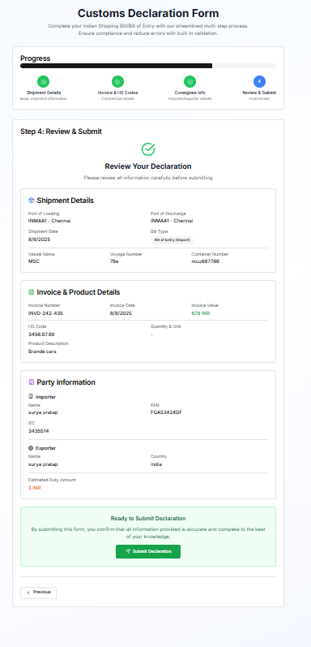
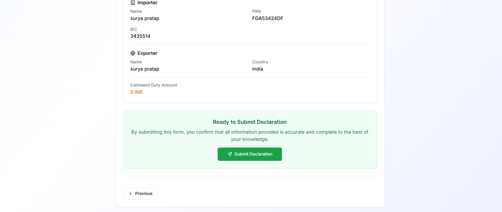

# 📦 Customs Declaration Form UI

A multi-step form to simulate the process of submitting **Shipping Bills** / **Bills of Entry**, commonly used by Customs Brokers. Designed to reduce user errors, improve UX, and optimize form flow using modern frontend tools.

## 📸 Screenshots

### Step 1



### Step 2



### Step 3



### Step 4



## ✅ Features

- Multi-step form with **validation**, **tooltips**, and **field-specific feedback**
- Tailored for Indian customs documentation
- Smooth transitions, logical flow, and responsive UI
- Technologies used: `Next.js`, `Tailwind CSS`, `React Hook Form`, `Zod`, `Radix UI`

## 🚀 Getting Started

### 1. Clone the Repository

```bash
git clone https://github.com/your-username/customs-declaration-form.git
cd customs-declaration-form
```

### 2. Install Dependencies

Ensure you have `Node.js >= 16` and `npm` or `yarn`.

```bash
npm install

```

### 3. Run Development Server

```bash
npm run dev

```

Visit `http://localhost:3000` in your browser.

## 🗂️ Project Structure

```
/components/forms/
  ├── Step1ShipmentDetails.tsx
  ├── Step2InvoiceDetails.tsx
  ├── Step3-consigneeinfo
  ├── Finalstep-ReviewSubmit.tsx
  └── FormWrapper.tsx

/app/
  └── page.tsx        # Root of the app

/utils/
  └── validations.ts  # Zod schemas and validation logic
```

## 🧩 Steps & Breakdown

### ✅ Step 1: Shipment Details

- Origin Country
- Destination Country
- Port Name, Vessel Name
- Date of Departure

### ✅ Step 2: Invoice + HS Code + Consignee

- Invoice Number, Date
- HS Code
- Exporter & Importer Info
- Consignee Address

### ✅ Step 3:consigneeinfo

- Importer Information
- Importer Address
- conatining info importer and exporter

- ### ✅ Step 4 final:Review & Submit
- - Review all entries
- Submit button

## 🧠 Validations

Handled via **Zod + React Hook Form**  
Each step validates on `onBlur` and `onSubmit`:

```ts
const shipmentSchema = z.object({
  origin: z.string().min(1, "Origin is required"),
  destination: z.string().min(1, "Destination is required"),
  // ...
});
```

## 🎨 UI Libraries Used

- **Tailwind CSS** – Styling
- **Radix UI** – Tooltips, Accordions, Dialogs
- **Lucide React** – Icons
- **Sonner** – Toasts/alerts
- **React Hook Form + Zod** – Validations

## ✅ Acceptance Criteria

- ✅ Smooth navigation between form steps
- ✅ Clear field validations & error messages
- ✅ Mobile-responsive layout
- ✅ Clean UI with good spacing and readability
